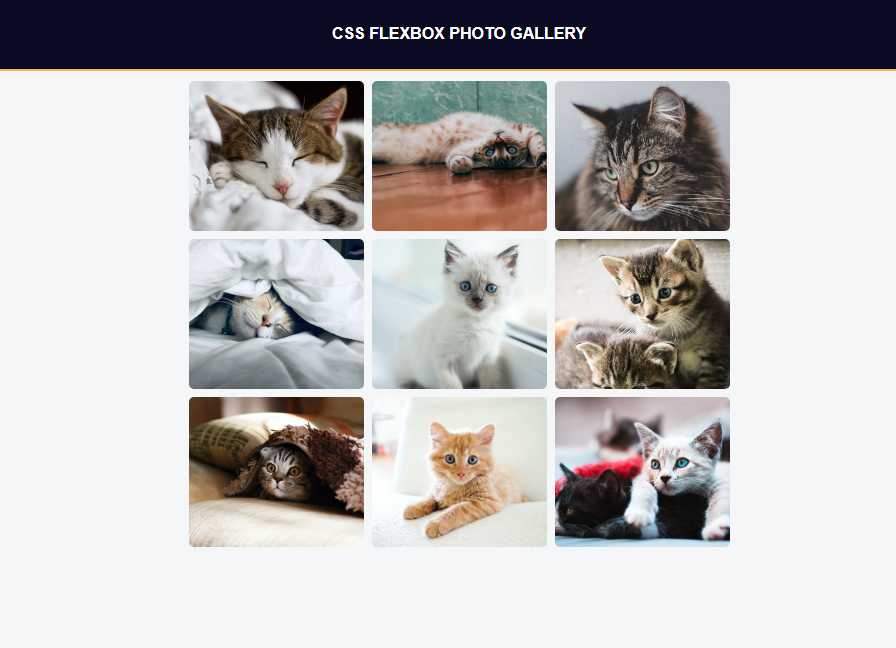

# CatFlex Gallery

## Descrição

CatFlex Gallery é uma galeria de fotos responsiva e moderna construída com HTML e CSS. O projeto utiliza Flexbox para criar um layout adaptável e elegante, apresentando uma coleção de imagens de diferentes raças de gatos. Este projeto foi desenvolvido como parte dos exercícios do FreeCodeCamp.

## Recursos

- HTML semântico e bem estruturado
- CSS moderno e responsivo com Flexbox
- Galeria de fotos adaptável para diferentes dispositivos e tamanhos de tela
- Cabeçalho fixo para melhorar a experiência do usuário

## Instalação

1. Faça um clone deste repositório ou baixe-o como um arquivo zip.
2. Abra o arquivo `index.html` em seu navegador para visualizar o projeto.

## Demonstração

Uma versão ao vivo do projeto pode ser visualizada [aqui](https://reginaldoassuncao.github.io/CatFlex-Gallery/).

## Crédito

Este projeto foi desenvolvido com base em um exercício do [FreeCodeCamp](https://www.freecodecamp.org/).

## Licença

Este projeto está licenciado sob a licença MIT - consulte o arquivo [LICENSE](LICENSE) para obter mais detalhes.
