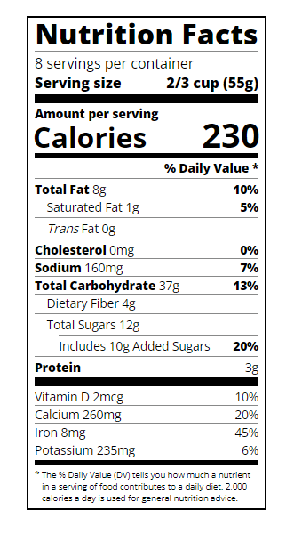

# Nutrition Facts Label

## Descrição do Projeto
Este é um projeto de front-end que apresenta um rótulo de informações nutricionais. Ele foi criado como parte do curso de programação web no FreeCodeCamp. Este projeto utiliza HTML e CSS para estruturar e estilizar a página.

## Como Visualizar
Para visualizar o projeto, você pode clonar este repositório e abrir o arquivo `index.html` em seu navegador.

## Tecnologias Usadas
* HTML
* CSS

## Objetivos do Projeto
Este projeto foi desenvolvido com o objetivo de demonstrar a capacidade de criar uma página web estática bem estruturada e estilizada.

## Contribuições
Contribuições são sempre bem-vindas. Sinta-se à vontade para abrir uma issue ou um pull request.

## Licença
Este projeto é licenciado sob a Licença MIT - veja o arquivo `LICENSE.md` para mais detalhes.

## Contato
Reginaldo Assunção - regi.assuncao@hotmail.com
