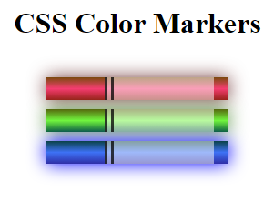

# CSS Color Markers

## Índice

- [Sobre](#sobre)
- [Tecnologias utilizadas](#tecnologias-utilizadas)
- [Instalação e execução](#instalação-e-execução)
- [Estrutura do projeto](#estrutura-do-projeto)
- [Licença](#licença)

## Sobre

Este projeto foi desenvolvido para demonstrar o uso de gradientes e box-shadow em CSS, criando marcadores coloridos. Os marcadores apresentados neste projeto têm três cores diferentes: vermelho, verde e azul. O projeto tem como objetivo ajudar outros desenvolvedores a aprender e se inspirar no uso de técnicas avançadas de CSS.

## Tecnologias utilizadas

As tecnologias utilizadas neste projeto são:

- HTML5
- CSS3

## Instalação e execução

Siga os passos abaixo para instalar e executar o projeto em seu ambiente local:

1. Clone este repositório ou faça o download dos arquivos.

git clone https://github.com/reginaldoassuncao/css-color-markers.git

2. Abra o arquivo `index.html` em seu navegador.

## Estrutura do projeto

O projeto possui a seguinte estrutura de arquivos e pastas:

.
├── index.html
├── styles.css
└── README.md

- `index.html`: Contém a estrutura HTML básica e a marcação para os marcadores coloridos.
- `styles.css`: Contém os estilos CSS para o projeto, incluindo gradientes e box-shadow.
- `README.md`: Este arquivo, que fornece informações e instruções sobre o projeto.

## Licença

Este projeto está licenciado sob a Licença MIT. Consulte o arquivo [LICENSE](LICENSE) para obter mais informações.
