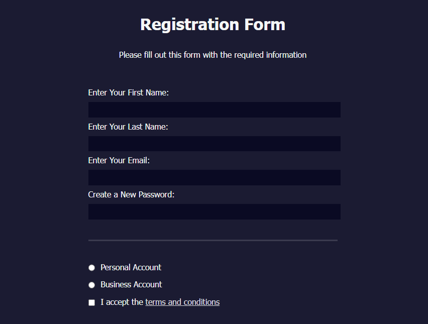

# Formulário de Registro Responsivo em HTML e CSS

Este repositório contém um exemplo de formulário de registro responsivo e acessível, criado com HTML e CSS puros. O projeto demonstra as melhores práticas para criar um formulário de registro atraente e funcional, incluindo validação de campos e organização de elementos de entrada.

## Recursos

- Design responsivo que se adapta a diferentes tamanhos de tela e dispositivos
- Uso de HTML semântico para melhor acessibilidade e compreensão por leitores de tela
- Validação de campos obrigatórios com atributos HTML `required` e `pattern`
- Organização de campos relacionados com a tag `fieldset`
- Estilização personalizada com CSS para melhorar a aparência do formulário

## Visualização

## Como usar

1. Clone este repositório ou faça o download dos arquivos como um arquivo ZIP.
2. Abra o arquivo `index.html` em seu navegador para visualizar o formulário.
3. Personalize o HTML e o CSS conforme necessário para atender às suas necessidades específicas.

## Contribuição

Este é um projeto de exemplo, e contribuições são bem-vindas. Sinta-se à vontade para abrir uma issue ou enviar um pull request com melhorias ou correções.

## Licença

Este projeto é licenciado sob a licença MIT. Consulte o arquivo `LICENSE` para obter mais informações.

---

Desenvolvido com dedicação por um entusiasta da programação. Aproveite e sinta-se à vontade para personalizar este projeto conforme suas necessidades!
